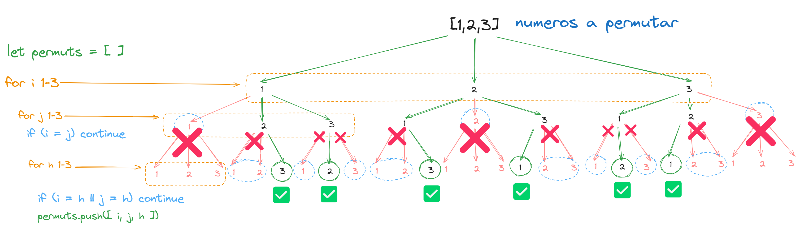
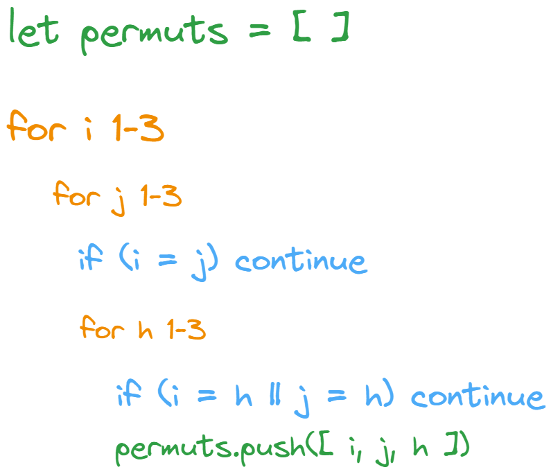

## Entedemos como funciona la combinatoria

Con el fin de entender como funciona la iteracion para la combinatoria y como objetivo implementar recursividad

Ese proceso se reflejerá en el siguiente código:

