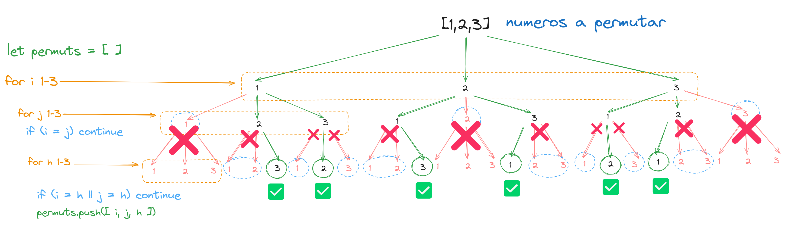
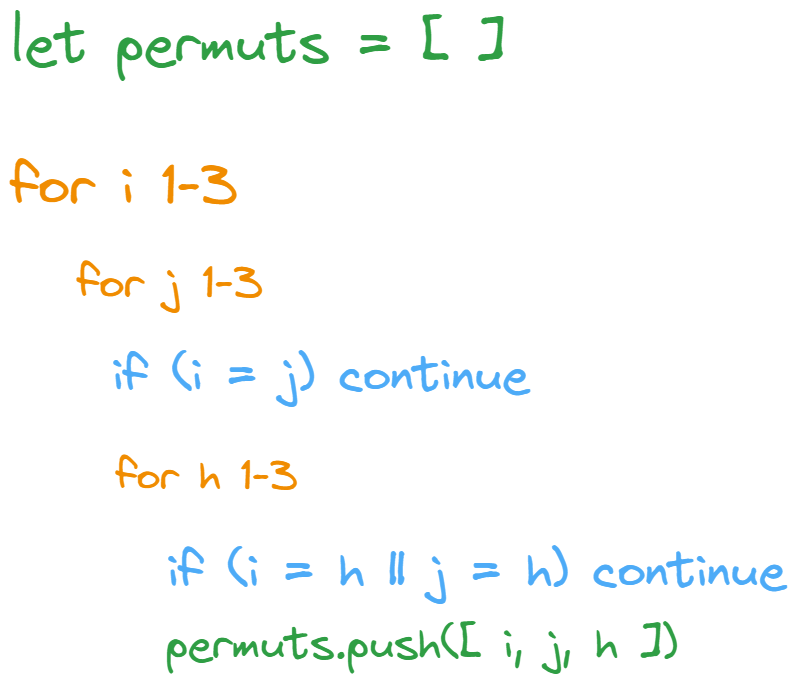

## Entedemos como funciona la permutacion

Con el fin de entender como funciona la iteracion para la permutacion y como objetivo implementar recursividad

Ese proceso se reflejerá en el siguiente código:

